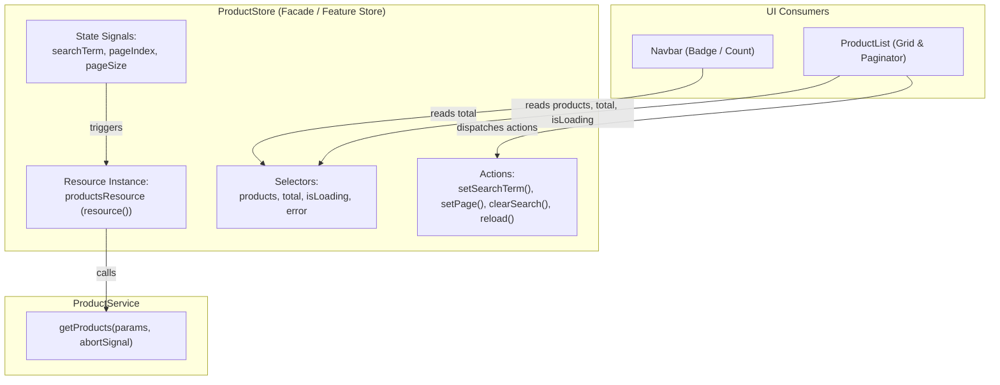

# Angular Resource API Guide (`resource()`)

This document provides a comprehensive guide, architecture overview, and reference for the **Resource API (`resource()`)** in Angular, featuring the **Facade / Feature Store** pattern implemented in this project.

---

## 1. Overview

The `resource()` API is a declarative, signal-first bridge designed to coordinate asynchronous data fetching with Angular's reactive signal graph.

### Core Value Proposition
* **Declarative Reactivity**: Automatically initiates and re-triggers data fetches when input signals change.
* **Unified State**: Consolidates `value`, `isLoading`, `error`, and `status` into a single reactive object without managing separate signals manually.
* **Automatic Cancellation & Race Condition Protection**: Integrates standard DOM `AbortSignal` to cancel stale in-flight requests when parameters change rapidly or when components unmount.
* **Zero Subscription Boilerplate**: Eliminates the need for manual `takeUntilDestroyed()`, RxJS subscription management, or `async` pipe unwrapping.

---

## 2. API Signature & Type Parameters

```typescript
import { resource, ResourceRef } from '@angular/core';

const myResource: ResourceRef<T> = resource<T, P>({
  params: () => P,
  loader: async ({ params, abortSignal, previous }) => Promise<T>,
});
```

### Type Parameters
* **`T` (`ProductResponse`)**: The resolved data payload type.
* **`P` (`ProductQueryParams`)**: The parameter payload type computed from dependent signals.

---

## 3. Configuration Options

### `params` (or `request`)
A reactive computation function (similar to `computed()`).
* **Dependency Tracking**: Tracks all signals read within its execution body (e.g. `this.searchTerm()`, `this.pageIndex()`, `this.pageSize()`).
* **Trigger Mechanism**: Whenever any tracked signal emits a new value, `params` is re-evaluated and the `loader` is invoked with the new parameters.
* **Idle State**: If `params` returns `undefined`, the resource enters an `Idle` state without executing the loader.

### `loader`
An `async` function responsible for retrieving the data.
* **Arguments**:
  1. `params`: The latest evaluated result of the `params` function.
  2. `abortSignal`: A standard browser `AbortSignal` triggered when:
     * A new parameter is emitted before the current asynchronous operation completes.
     * The host component or injection context is destroyed.
  3. `previous`: Metadata containing the previous status and previously resolved value.

> [!TIP]
> Always pass `abortSignal` directly to your network request (e.g., `fetch(url, { signal: abortSignal })`). This automatically prevents outdated or out-of-order responses from overwriting newer search results.

---

## 4. `ResourceRef` Signals and Methods

The object returned by `resource()` exposes the following reactive signals and imperative methods:

### Signals (Read-Only)
| Member | Type | Description |
| :--- | :--- | :--- |
| `resource.value()` | `Signal<T \| undefined>` | The current resolved data. Returns `undefined` before the first successful fetch. |
| `resource.isLoading()` | `Signal<boolean>` | `true` while the resource is performing an initial fetch or reloading. |
| `resource.error()` | `Signal<unknown>` | Contains the error or exception thrown during `loader` execution (`undefined` if no error). |
| `resource.status()` | `Signal<ResourceStatus>` | Fine-grained status enum: `Idle`, `Loading`, `Resolved`, `Error`, `Reloading`, `Local`. |

### Imperative Methods
| Method | Signature | Description |
| :--- | :--- | :--- |
| `resource.reload()` | `() => boolean` | Imperatively forces the loader to re-fetch data with current parameters (useful for "Retry" buttons). |
| `resource.set(val)` | `(value: T) => void` | Manually updates the local value without invoking the `loader`. |
| `resource.update(fn)` | `(updater: (prev: T) => T) => void` | Updates the local value based on current value (useful for optimistic UI updates). |
| `resource.destroy()` | `() => void` | Cancels any pending loaders and disposes of the resource. |

---

## 5. Architectural Patterns for Scaling



### Comparing Pattern 1 vs. Pattern 2

| Dimension | Pattern 1: Component-Scoped Resource | Pattern 2: Facade / Feature Store (Implemented) |
| :--- | :--- | :--- |
| **State Ownership** | Inside Component class (`ProductList`). | Inside Shared Store Service (`ProductStore`). |
| **State Lifecycle** | State is destroyed when navigating away. | State is preserved across routes & component navigation. |
| **Multi-Component Sharing** | Difficult; requires `@Input()` / `@Output()` chains. | Effortless; any component injects `ProductStore`. |
| **Component Complexity** | Component manages state signals + data access. | Component is purely presentational ("dumb" UI). |
| **Testability** | Test must configure component + mock services. | Store can be tested as a plain TypeScript class. |

---

## 6. Complete Implementation Reference

### 1. Data Access Layer: [`product.service.ts`](../src/app/products/product.service.ts)

```typescript
import { Injectable } from '@angular/core';
import { ProductResponse } from './product';

export interface ProductQueryParams {
  searchTerm: string;
  pageIndex: number;
  pageSize: number;
}

@Injectable({
  providedIn: 'root',
})
export class ProductService {
  private readonly baseUrl = 'https://dummyjson.com/products';

  /**
   * Fetches paginated products with optional search query from the API.
   */
  async getProducts(
    params: ProductQueryParams,
    abortSignal?: AbortSignal,
  ): Promise<ProductResponse> {
    const query = params.searchTerm.trim();
    const limit = params.pageSize;
    const skip = params.pageIndex * params.pageSize;

    const endpoint = query
      ? `${this.baseUrl}/search?q=${encodeURIComponent(query)}&limit=${limit}&skip=${skip}`
      : `${this.baseUrl}?limit=${limit}&skip=${skip}`;

    const response = await fetch(endpoint, { signal: abortSignal });

    if (!response.ok) {
      throw new Error(
        `Failed to fetch products: ${response.status} ${response.statusText}`,
      );
    }

    return await response.json();
  }
}
```

### 2. Facade Store Layer: [`product.store.ts`](../src/app/products/product.store.ts)

```typescript
import { computed, inject, Injectable, resource, signal } from '@angular/core';
import { ProductResponse } from './product';
import { ProductQueryParams, ProductService } from './product.service';

@Injectable({
  providedIn: 'root',
})
export class ProductStore {
  private readonly productService = inject(ProductService);

  // 1. Reactive State Signals
  readonly searchTerm = signal('');
  readonly pageIndex = signal(0);
  readonly pageSize = signal(10);

  // 2. Resource managed centrally by the Store
  readonly productsResource = resource<ProductResponse, ProductQueryParams>({
    params: () => ({
      searchTerm: this.searchTerm(),
      pageIndex: this.pageIndex(),
      pageSize: this.pageSize(),
    }),
    loader: ({ params, abortSignal }) =>
      this.productService.getProducts(params, abortSignal),
  });

  // 3. Computed Selectors
  readonly products = computed(
    () => this.productsResource.value()?.products ?? [],
  );
  readonly total = computed(
    () => this.productsResource.value()?.total ?? 0,
  );
  readonly isLoading = this.productsResource.isLoading;
  readonly error = this.productsResource.error;

  // 4. Action Methods
  setSearchTerm(term: string): void {
    this.searchTerm.set(term);
    this.pageIndex.set(0);
  }

  setPage(pageIndex: number, pageSize: number): void {
    this.pageIndex.set(pageIndex);
    this.pageSize.set(pageSize);
  }

  clearSearch(): void {
    this.setSearchTerm('');
  }

  reload(): void {
    this.productsResource.reload();
  }
}
```

### 3. Component Layer: [`product-list.ts`](../src/app/products/resource-example/product-list/product-list.ts)

```typescript
import { ChangeDetectionStrategy, Component, inject } from '@angular/core';
import { FormsModule } from '@angular/forms';
import { MatButtonModule } from '@angular/material/button';
import { MatFormFieldModule } from '@angular/material/form-field';
import { MatIconModule } from '@angular/material/icon';
import { MatInputModule } from '@angular/material/input';
import { MatPaginatorModule, PageEvent } from '@angular/material/paginator';
import { MatProgressSpinnerModule } from '@angular/material/progress-spinner';
import { ProductStore } from '../../product.store';
import { ProductCard } from '../product-card/product-card';

@Component({
  selector: 'product-list',
  imports: [
    ProductCard,
    MatIconModule,
    MatInputModule,
    FormsModule,
    MatFormFieldModule,
    MatButtonModule,
    MatProgressSpinnerModule,
    MatPaginatorModule,
  ],
  changeDetection: ChangeDetectionStrategy.OnPush,
  templateUrl: './product-list.html',
  styleUrl: './product-list.scss',
})
export class ProductList {
  // Inject the Store Facade
  protected readonly store = inject(ProductStore);

  protected onPageChange(event: PageEvent) {
    this.store.setPage(event.pageIndex, event.pageSize);
  }
}
```

### 4. HTML Template:

```html
<div class="products-container">
  <!-- Search Input -->
  <mat-form-field appearance="outline" class="search-field">
    <mat-label>Search Products</mat-label>
    <input
      matInput
      [ngModel]="store.searchTerm()"
      (ngModelChange)="store.setSearchTerm($event)"
      placeholder="e.g. mascara, phone, perfume"
    />
    @if (store.searchTerm()) {
      <button mat-icon-button matSuffix (click)="store.clearSearch()" aria-label="Clear search">
        <mat-icon>close</mat-icon>
      </button>
    }
  </mat-form-field>

  <!-- State 1: Loading -->
  @if (store.isLoading()) {
    <div class="loading-state">
      <mat-spinner diameter="48"></mat-spinner>
      <p>Loading products...</p>
    </div>
  }

  <!-- State 2: Error with Retry -->
  @else if (store.error()) {
    <div class="error-state">
      <mat-icon>error_outline</mat-icon>
      <p>Failed to load products</p>
      <button mat-flat-button (click)="store.reload()">Retry</button>
    </div>
  }

  <!-- State 3: Resolved Data Grid & Paginator -->
  @else {
    <div class="products-grid">
      @for (product of store.products(); track product.id) {
        <product-card [product]="product" />
      } @empty {
        <div class="empty-state">
          <mat-icon>inventory_2</mat-icon>
          <p>No products match your search</p>
        </div>
      }
    </div>

    @if (store.total() > 0) {
      <mat-paginator
        [length]="store.total()"
        [pageSize]="store.pageSize()"
        [pageIndex]="store.pageIndex()"
        [pageSizeOptions]="[5, 10, 15, 20]"
        [showFirstLastButtons]="true"
        (page)="onPageChange($event)"
        aria-label="Select page of products"
      >
      </mat-paginator>
    }
  }
</div>
```

---

## 7. Reasoning & Architectural Benefits

### 1. Persistent State Across Routing
* When navigating from `/product-list` to `/home` and back, the user's active page, search query, and loaded product cache remain intact without triggering unnecessary HTTP round-trips.

### 2. High Cohesion & Loose Coupling
* Components focus strictly on HTML presentation and DOM events.
* Data access rules, URL schemes, and backend contracts are isolated to `ProductService`.
* Application state, caching, pagination, and search policies are unified in `ProductStore`.

### 3. Cross-Component Interoperability
* Sibling components (such as [`Nav`](../src/app/common/nav/nav.ts) displaying total count badges) consume `ProductStore` without complex event passing or duplicate API requests.

### 4. Direct Support for Angular's OnPush Strategy
* All selectors (`products()`, `total()`, `isLoading()`, `error()`) are native signals, ensuring minimal, localized DOM repaints under `ChangeDetectionStrategy.OnPush`.
